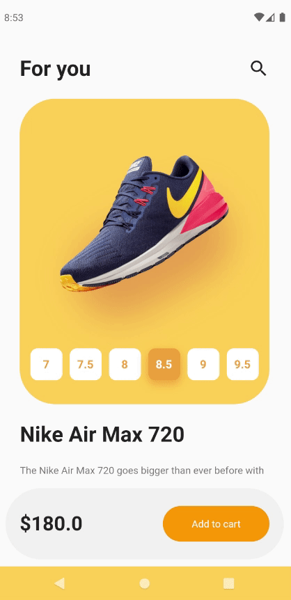

# Shoes Showcase App - Flutter

## Description
 

The purpose of this project is to create an app able to visualize shoes and its different designs, you can edit the size and color.
It is based on flat design to display only important information while maintaining style. Part of a Flutter course taught by Fernando Herrera at Udemy.

## Technical info
This app was created with Flutter v2.2.3 and Dart. Includes null-safety!

Packages:
- cupertino_icons: ^1.0.2
- animate_do: ^2.0.0
- provider: ^6.0.0

## Getting Started

For help getting started with Flutter, view
[online documentation](https://flutter.dev/docs), which offers tutorials,
samples, guidance on mobile development, and a full API reference.
